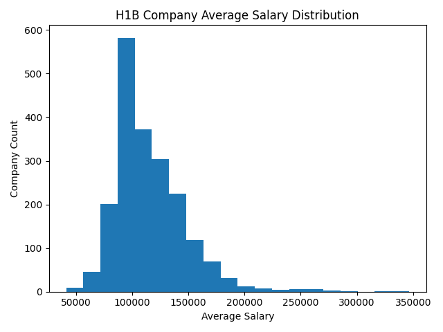
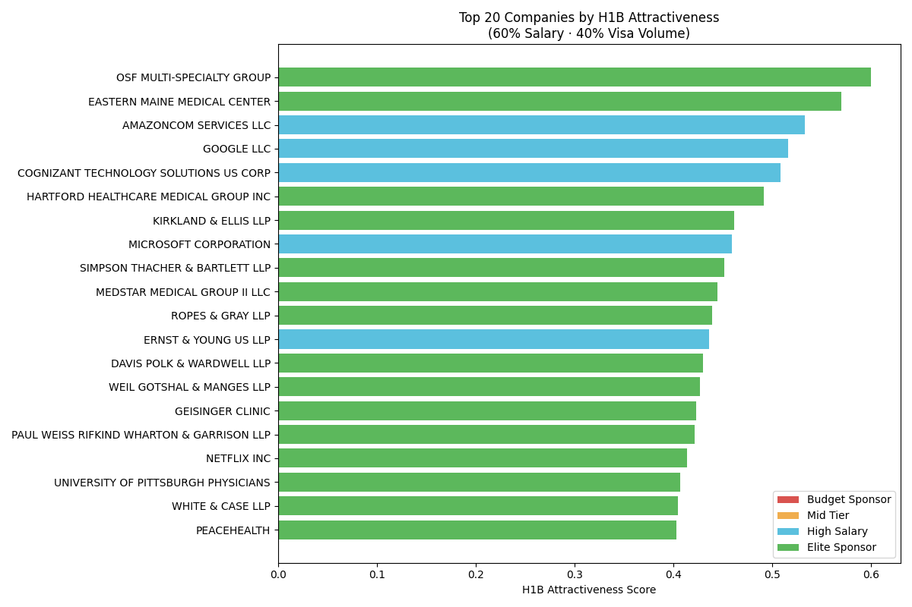

# H1B Job Tracking System 🚀

[](https://github.com/calvinlee326/h1b-job-scraper/actions)
[](https://opensource.org/licenses/MIT)

An automated solution for tracking U.S. H1B visa job opportunities in real-time.

---

## 📊 Visualizations

**Salary Distribution**


**Top 20 Companies by H1B Attractiveness Score**


---

## 🛠️ Quick Start

```bash
git clone https://github.com/calvinlee326/h1b-job-scraper.git
cd h1b-job-scraper

# Create and activate virtual environment
python3 -m venv .venv
source .venv/bin/activate       # macOS/Linux
# .venv\Scripts\activate        # Windows

pip install -r requirements.txt
python h1b_scraper.py
```

---

## 🌟 Key Features

- [x] **Automated Daily Data Collection** — scrapes ~2,000 top H1B companies from h1bdata.info every day via GitHub Actions
- [x] **Salary Distribution Visualization** — histogram of average salaries saved to `docs/salary_distribution.png`
- [x] **Anomaly Notification System** — flags statistical outliers (z-score > 2.5) and daily salary changes > 10%; writes a dated report to `data/anomalies_YYYY-MM-DD.txt` and posts a summary to the GitHub Actions run log
- [x] **Job Prediction Model** — scores every company by H1B attractiveness (60% salary + 40% visa volume), clusters them into four tiers, and saves ranked predictions to `data/h1b_predictions.csv`

---

## 📁 Output Files

| File | Description |
|------|-------------|
| `data/h1b_companies.csv` | Latest scraped data (overwritten daily) |
| `data/h1b_companies_YYYY-MM-DD.csv` | Dated archive for cross-day comparison |
| `data/h1b_predictions.csv` | Companies ranked by H1B attractiveness score + tier |
| `data/anomalies_YYYY-MM-DD.txt` | Daily anomaly report |
| `docs/salary_distribution.png` | Salary histogram |
| `docs/h1b_scores.png` | Top 20 companies bar chart |

---

## 📈 Data Sample

| Rank | Company Name | Approvals | Average Salary |
|------|--------------|-----------|----------------|
| 1 | Cognizant | 108,287 | $93,079 |
| 2 | Google | 60,090 | $160,551 |
| 3 | Microsoft | 50,227 | $153,166 |

---

## 📂 Project Structure

```
h1b-job-scraper/
├── .github/workflows/
│   └── daily-scrape.yml   # GitHub Actions — runs daily at 9 AM PST
├── data/
│   ├── h1b_companies.csv              # latest scrape
│   ├── h1b_companies_YYYY-MM-DD.csv   # daily archives
│   ├── h1b_predictions.csv            # attractiveness scores
│   └── anomalies_YYYY-MM-DD.txt       # anomaly reports
├── docs/
│   ├── salary_distribution.png
│   └── h1b_scores.png
├── h1b_scraper.py
└── requirements.txt
```

---

## 🤝 Contributing

PRs are welcome!
